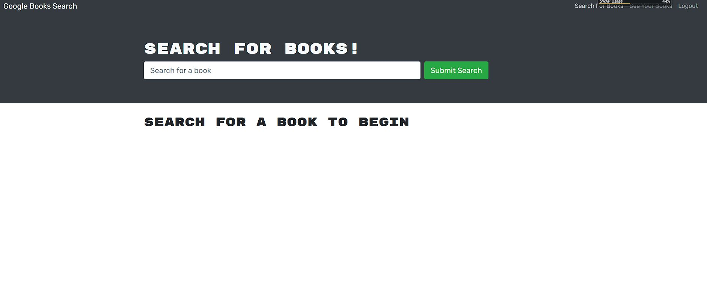

# BookEmporium

## Description

This project is a full stack application utilizing the MERN Stack that allows a user to search for books using the Google Books api and save them to their profile for use later. It is useful for creating lists of books you have already read or to look for books that you would like to read in the future.

## Usage

Begin by signing up for an account by clicking the Login/Signup button. A modal will pop out that will allow you to either create a new account or login to an existing one. Once you create a valid account, you will be logged in and can search for books using the search bar. Once you search, each book will populate a card that allows you to save that book to your profile. Once you click "See Your Books" you will be taken to a page where you can see every book you have saved and can remove them from your list.

## Demo

Here is a screenshot of the deployed website and a [link](https://serene-savannah-16976.herokuapp.com/) to the deployed page.

## Credits

Starter code and templates were provided by instructor.

## License

This application is licensed under the MIT license.
